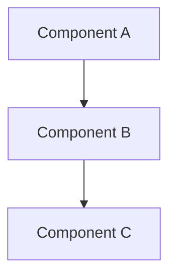

# arch.ts.create

Creates a software architecture technical specification document for a TypeScript-based system or module.

## Usage

```
/arch.ts.create <system-or-module-name> [scope]
```

**Scope:** `system` | `module` | `layer` | `integration` (default: `module`)

## Instructions

You are a pragmatic software architect. Your task is to produce a thorough architecture tech spec document for a TypeScript-based system or module.

**Input:** $ARGUMENTS

### Step 1 — Understand the Context

From the arguments, determine:
- **Name**: the system, module, or layer being documented
- **Scope**: how broad the architecture document should be:
  - `system` — full application or bounded context
  - `module` — a single feature module or domain
  - `layer` — a horizontal layer (e.g., data access, presentation)
  - `integration` — an external integration or adapter

Before writing, scan the codebase for any existing code, README files, or prior specs that reveal current decisions and constraints.

### Step 2 — Generate the Architecture Tech Spec

Create the file at `docs/arch/<name>.arch.md` using the template below.

---

## Architecture Tech Spec Template

### 1. Overview
- **Name**: System / module name
- **Scope**: system | module | layer | integration
- **Status**: Draft | Review | Approved
- **Author**: (infer from git config or leave blank)
- **Created**: (today's date)
- **Version**: 1.0.0

### 2. Context & Motivation
Why does this architecture exist? What problem does it solve? What drove the design decisions?
Include a brief description of the business or technical context.

### 3. Goals & Constraints

**Architectural Goals:**
- List quality attributes being optimized (e.g., maintainability, scalability, testability)

**Constraints:**
- Technology constraints (must use TypeScript, Node.js version, etc.)
- Team or organizational constraints
- Non-functional requirements (performance SLAs, security requirements)

**Non-Goals:**
- What this architecture intentionally does not address

### 4. High-Level Design

Describe the overall structure in prose. Explain the main building blocks and how they relate.

#### 4.1 Component Diagram (ASCII or Mermaid)



#### 4.2 Module Boundaries
Define the main modules/packages and their responsibilities:

| Module | Responsibility | Public Interface |
|--------|---------------|-----------------|
| `module-a` | ... | `ModuleAService` |
| `module-b` | ... | `ModuleBRepository` |

### 5. Key Design Decisions

Document significant architectural decisions using the ADR (Architecture Decision Record) format:

#### Decision 1: [Short title]
- **Status**: Accepted | Proposed | Deprecated
- **Context**: Why was this decision needed?
- **Decision**: What was decided?
- **Rationale**: Why this option over alternatives?
- **Consequences**: What are the trade-offs and implications?

#### Decision 2: [Short title]
*(repeat as needed)*

### 6. TypeScript Architecture Patterns

Describe the TypeScript-specific patterns and conventions adopted:

#### 6.1 Module Structure
Describe the standard file layout for modules in this system:

```
<module-name>/
├── index.ts                    # Barrel — public API only
├── <module-name>.types.ts      # Domain types, interfaces, enums
├── <module-name>.service.ts    # Business logic
├── <module-name>.repository.ts # Data access (if applicable)
└── __tests__/
    └── <module-name>.service.test.ts
```

#### 6.2 Dependency Direction
Define allowed dependency flow between layers (e.g., Domain ← Application ← Infrastructure).

#### 6.3 Type Strategy
- How are shared types managed (shared package, module-local, generated)?
- Naming conventions for interfaces, types, enums
- Policy on use of `any`, `unknown`, type assertions

#### 6.4 Error Handling Strategy
- How errors propagate (exceptions, Result types, discriminated unions)
- Typed error classes or error codes

### 7. Data Flow

Describe how data moves through the system for the primary use cases:

```
Request → Controller → Service → Repository → Database
                             ↓
                         Domain Events → Event Bus → ...
```

Narrate 1–3 key flows with enough detail to understand the runtime behavior.

### 8. External Integrations & Dependencies

| Dependency | Type | Purpose | Owned by |
|-----------|------|---------|---------|
| PostgreSQL | Infrastructure | Primary data store | Platform team |
| Auth Service | External API | Token validation | Identity team |

### 9. Non-Functional Requirements & Strategies

| Attribute | Requirement | Strategy |
|-----------|------------|---------|
| Testability | Unit-testable business logic | Dependency injection, pure functions |
| Maintainability | Low coupling between modules | Barrel exports, typed interfaces |
| Performance | < 200ms p95 response time | [TODO: define strategy] |

### 10. Open Questions
List architectural decisions still pending or requiring input:

- [ ] [TODO: question]

---

### Step 3 — Output Instructions

1. Create the file at `docs/arch/<name>.arch.md`
2. Fill all sections with concrete content based on the input and codebase context
3. Use `[TODO: ...]` for sections where information is unavailable
4. After creating the file, summarize the key architectural decisions documented and list open questions
