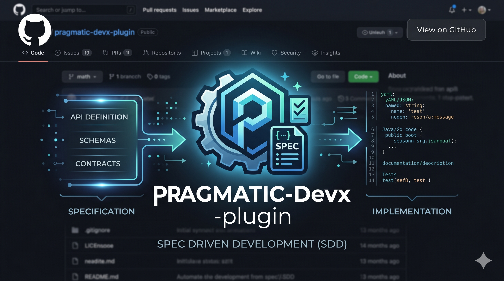

# pragmatic-devx-plugin

<div align="center">
  
  <h1 style="font-size: 28px; margin: 10px 0;">Pragmatic Devx Plugin</h1>
  <p>Spec Driven Development!</p>
</div>

Claude Code plugin focused on Developer Experience — structured specs, architecture documentation, and pragmatic engineering patterns.

> **See it in action:** [pragmatic-devx-showcase](https://github.com/rvfvazquez/pragmatic-devx-showcase)
> shows the plugin's skills applied end-to-end — `constitution → arch spec → feature spec →
> build → check` — against a single fictional domain, with every step as its own commit/PR so
> you can read the actual diff each skill produced.

## Installation

### Claude Code

**1. Add the marketplace:**

```bash
claude plugin marketplace add https://github.com/rvfvazquez/pragmatic-devx-plugin.git
```

**2. Install the plugin:**

```bash
claude plugin install pragmatic-devx-plugin@pragmatic-devx-plugin
```

Skills activate automatically. Claude detects intent from the conversation and loads the right skill. The SessionStart hook injects your project's constitution and spec summary into context at the start of every session.

---

### Codex (OpenAI)

**1. Clone the repository:**

```bash
git clone https://github.com/rvfvazquez/pragmatic-devx-plugin.git ~/pragmatic-devx-plugin
```

**2. Register the plugin:**

```bash
codex plugin add ~/pragmatic-devx-plugin
```

The `.codex-plugin/plugin.json` manifest is picked up automatically. Skills load when Codex detects matching intent.

---

### Gemini CLI

**1. Clone the repository:**

```bash
git clone https://github.com/rvfvazquez/pragmatic-devx-plugin.git ~/pragmatic-devx-plugin
```

**2. Install the extension:**

```bash
gemini extension install ~/pragmatic-devx-plugin
```

The extension is registered via `gemini-extension.json`. At session start, Gemini loads `GEMINI.md` which references all 13 skill files — no further configuration needed.

---

### Cursor

**1. Clone the repository:**

```bash
git clone https://github.com/rvfvazquez/pragmatic-devx-plugin.git ~/pragmatic-devx-plugin
```

**2. Register the plugin in Cursor settings:**

Open **Settings → Features → Custom plugins** and add the path to the cloned directory. The `.cursor-plugin/plugin.json` manifest is picked up automatically.

Skills load as conversation context when Cursor detects matching intent. The SessionStart hook injects project constitution and spec state into each new session.

---

### Antigravity (agy)

```bash
agy plugin install https://github.com/rvfvazquez/pragmatic-devx-plugin
```

Antigravity reads `package.json` → `"pi"` section, loads `.pi/extensions/pragmatic-devx.ts`, and registers the `skills/` directory for skill discovery. At session start, the extension injects `pragmatic-howto` as bootstrap context so the agent knows the full skill map without an explicit prompt.

## Skill Lifecycle

The plugin organizes its skills into three layers. Each layer builds on the one above it — but you can start at any layer that matches your current need.

```
LAYER 0 ── Project Constitution  (once per project)
LAYER 1 ── Arch Spec Track       (once per module)
LAYER 2 ── Feature Spec Track    (once per feature)
```

### Big Picture

```
╔══════════════════════════════════════════════════════════════════╗
║              pragmatic-project-constitution                      ║
║  Project identity · global tech stack · cross-module rules       ║
║  AI guardrails                  (auto-loaded every session)      ║
╚══════════════════════════╤═══════════════════════════════════════╝
                           │ consulted by every skill below
          ┌────────────────┴─────────────────────────┐
          │                                           │
          ▼                                           │
┌─────────────────────┐                              │
│   ARCH SPEC TRACK   │                              │
│                     │                              │
│  arch-spec-create   │                              │
│         │           │                              │
│  arch-spec-validate │                              │
│       │    ▲        │                              │
│       │    └─ arch-spec-update (revise)            │
│       │             │                              │
│  arch-spec-check    │                              │
│    │        │       │                              │
│ CONFORM  NON-CONFORM│                              │
│    │        │       │                              │
│    │   Option A: fix code → re-check               │
│    │   Option B: arch-spec-update → re-check       │
└────┼────────────────┘                              │
     │                                               │
     │  arch rules flow into feature spec track      │
     │  at three points (see below)                  │
     │                                               ▼
     │                              ┌────────────────────────────┐
     │                              │   FEATURE SPEC TRACK       │
     │                              │                            │
     │   ┌── reads docs/arch/ ──────►  spec-create              │
     │   │                          │       │                    │
     │   │                          │  spec-validate             │
     │   │                          │     │    ▲                 │
     │   │                          │     │    └─ spec-update    │
     │   │                          │     │       (revise)       │
     │   │                          │     │                      │
     │   ├── loads arch rules ───────►  spec-build              │
     │   │   (constraint brief)     │       │                    │
     │   │                          │  spec-check               │
     │   └── enforces arch rules ───►    │       │              │
     │                              │  PASS    FAIL             │
     │                              │  (done)    │              │
     │                              │         spec-update       │
     │                              │         (and re-run)      │
     └──────────────────────────────┴────────────────────────────┘
```

---

### Reverse Engineering — an Alternate Entry Point

When code already exists with no spec or arch spec at all, `pragmatic-reverse-engineer` is the entry point instead of starting a lifecycle interview from scratch. It scans the code, tags findings CONFIRMED (observable) or INFERRED (a guess), then hands off to `pragmatic-arch-spec-create` and/or `pragmatic-spec-create` — those two skills still author and own the documents; this is only a different way to arrive at their first step. See the dedicated section below.

---

### Layer 0 — Project Constitution

Defined **once per project**, before any spec or arch work begins. The constitution is loaded automatically at every session and constrains all skills below it.

> "Create a project constitution — we use TypeScript and PostgreSQL everywhere, AuthModule owns all user identity, and the AI must never add a new dependency without asking first."

`pragmatic-project-constitution` runs a discovery interview (scanning existing `docs/arch/`, `.claude/rules/`, and `CLAUDE.md` first to avoid re-asking what's already decided), then writes two files:

- `docs/constitution.md` — human-readable governance document with project identity, global tech stack decisions, cross-module rules, and AI guardrails
- `.claude/rules/00-project-constitution.md` — directive form, prefixed `00-` so it loads before any module-specific rules in every session

If a future spec, implementation, or arch decision conflicts with the constitution, the skill stops and flags the conflict explicitly — it never silently picks a side.

---

### Layer 1 — Arch Spec Track

Defined **once per module**, before feature specs for that module are written. Arch specs act as rules files that the feature spec track reads automatically.

```
arch-spec-create → arch-spec-validate ──► arch-spec-check
                          ▲                      │
                   arch-spec-update ◄── NON-CONFORMANT (Option B)
                                                 │
                                        arch-spec-check (re-run)
```

**Step 1 — Document the architecture**

> "Create an architecture spec for the payments module."

`pragmatic-arch-spec-create` scans the codebase and generates `docs/arch/payments.arch.md` — component boundaries, ADRs, dependency direction, data flow, and NFRs.

**Step 2 — Validate the spec document**

> "Is the payments arch spec ready to use as reference?"

`pragmatic-arch-spec-validate` reviews the document in isolation (not the code). Checks completeness, soundness (no circular coupling), clarity, and design quality. Outputs a grouped PASS / WARN / FAIL report.

**Step 3 — Check code conformance**

> "Does the payments code follow the arch spec?"

`pragmatic-arch-spec-check` compares the live codebase against the declared rules via static analysis (file structure, imports, naming, dependency direction). Every violation includes a mandatory **How to Fix** block.

**Step 4a — Fix the code (Option A)**

The code is wrong. Fix it to match the spec, then re-run `pragmatic-arch-spec-check`.

**Step 4b — Update the spec (Option B)**

> "We adopted an anti-corruption layer — the spec hasn't caught up yet."

`pragmatic-arch-spec-update` captures the decision as a new ADR (options, rationale, consequences), deprecates the superseded ADR, bumps the version, and appends a changelog entry. Re-run `pragmatic-arch-spec-check` to confirm the spec now describes reality.

---

### Layer 2 — Feature Spec Track

Run **once per feature or story**, after the module's arch spec is in place (if one exists). The feature spec track reads arch rules at three points automatically — no extra configuration needed.

```
spec-create → spec-validate ──► spec-build → spec-check
                   ▲                               │
             spec-update ◄────────── FAIL ─────────┘
```

| Step | Skill reads arch spec | What it does with it |
|---|---|---|
| `spec-create` | yes | Respects module boundaries and technology decisions when drafting the spec |
| `spec-build` | yes | Builds a constraint brief (dependency direction, naming, forbidden imports) before writing any code |
| `spec-check` | yes | Enforces arch rules as additional conformance criteria alongside spec acceptance criteria |

**Step 1 — Write the spec**

> "Create a spec for the notifications module — it should support email and in-app channels."

`pragmatic-spec-create` scans the codebase, reads the constitution and any arch specs in `docs/arch/`, then generates `docs/specs/notifications.md` with all sections filled in and `[TODO: ...]` markers for open decisions.

**Step 2 — Validate it**

> "Is the notifications spec ready for review?"

`pragmatic-spec-validate` runs 20+ checks (completeness, clarity, consistency, unresolved TODOs) and outputs a PASS / WARN / FAIL report — without touching the file.

**Step 3 — Resolve open items (if needed)**

> "Fill in the TODO for delivery ordering and bump the version."

`pragmatic-spec-update` preserves history, increments the version, and appends a changelog entry. Re-run `pragmatic-spec-validate` until the spec passes.

**Step 4 — Implement**

> "Implement the notifications spec — it's approved."

`pragmatic-spec-build` reads the spec and arch rules, builds a constraint brief, then implements each acceptance criterion as a tracked task with test stubs in Given/When/Then format.

**Step 5 — Verify**

> "Check if the notifications implementation matches the spec."

`pragmatic-spec-check` compares the live code against every acceptance criterion and applicable arch rules. Returns PASS (done) or FAIL with a diff-style report linking each gap to the criterion it violates.

---

## Skills

These are **context-triggered skills**, not slash commands. Just describe what you want in natural language and Claude will apply the right skill automatically.

---

### `pragmatic-spec-create`

Creates a structured technical specification document for a feature, story, or module.

Generates a full spec at `docs/specs/<feature-slug>.md` covering problem statement, goals, proposed solution, detailed design, and acceptance criteria.

**Triggers when you say things like:**
- "Create a spec for the notifications module"
- "Write a technical specification for this feature"
- "Document this story as a spec"
- "I need a spec for the payment flow"

**Example:**

> You: "Create a spec for the user authentication feature — it should support email/password and OAuth via Google."

Claude will scan the codebase for existing patterns, then generate `docs/specs/user-authentication.md` with all sections filled in and `[TODO: ...]` markers for decisions that still need human input.

---

### `pragmatic-spec-update`

Updates an existing specification with new requirements, corrections, or decisions.

Preserves existing content, increments the version, marks removed content as deprecated, and appends a changelog entry.

**Triggers when you say things like:**
- "Update the auth spec — token expiry is now 24h instead of 1h"
- "Add the rate limiting requirement to docs/specs/api-gateway.md"
- "Fill in the TODO items in the payment spec"
- "The acceptance criteria changed, revise the spec"

**Example:**

> You: "Update docs/specs/user-authentication.md — we decided to drop OAuth for now and support only email/password in v1."

Claude will update the relevant sections, bump the version to `1.1.0`, mark the OAuth content with `~~strikethrough~~`, and append a changelog entry with today's date.

---

### `pragmatic-spec-validate`

Validates a specification for completeness, clarity, and consistency.

Runs structured checks across completeness, clarity, consistency, and technical requirements. Outputs a detailed PASS/WARN/FAIL report without modifying the spec.

**Triggers when you say things like:**
- "Validate docs/specs/user-authentication.md"
- "Is this spec ready for review?"
- "Check the payment spec for completeness"
- "Run a quality check on this specification"

**Example:**

> You: "Validate the auth spec before we hand it off to the team."

Claude will check for missing acceptance criteria, vague language, unresolved TODOs, and inconsistencies between the proposed solution and the API design, then print a full report:

```
## Spec Validation Report
Overall Status: WARN

✓ Title & Status
✓ Problem Statement
⚠ Acceptance Criteria — only 1 defined, minimum is 2
✗ Security Considerations — section is empty
```

---

### `pragmatic-project-constitution`

Creates a project-wide governance document that defines what every agent, developer, and spec in the project must respect — regardless of module or feature.

Generates two artifacts: `docs/constitution.md` (human-readable governance document) and `.claude/rules/00-project-constitution.md` (auto-loaded by Claude Code every session). Covers project identity, non-negotiable tech stack decisions, cross-module constraints, and AI behavior guardrails.

**Triggers when you say things like:**
- "Create a project constitution"
- "Define the global rules for this project"
- "Set up project governance"
- "Define what the AI can decide alone"
- "Document global architecture decisions"

**Example:**

> You: "Create a project constitution — we use TypeScript and PostgreSQL everywhere, AuthModule owns all user identity, and the AI must never add a new dependency without asking first."

Claude will scan existing `docs/arch/`, `.claude/rules/`, and `CLAUDE.md` for decisions already in force, run a discovery interview for anything not yet documented, then generate `docs/constitution.md` with all four sections (project identity, global tech stack, cross-module rules, AI guardrails) and extract concrete directives into `.claude/rules/00-project-constitution.md` — loaded automatically in every future session.

---

### `pragmatic-arch-spec-create`

Creates a software architecture technical specification document for a system, module, layer, or integration.

Generates a full architecture tech spec at `docs/arch/<name>.arch.md` covering context, design decisions (ADRs), component boundaries, architecture patterns, communication style, data flow, and non-functional requirements.

**Scope options:** `system` | `module` | `layer` | `integration` (default: `module`)

**Triggers when you say things like:**
- "Create an architecture spec for the payments module"
- "Document the architecture of the notification service"
- "Write an arch spec for the auth layer — scope is module"
- "I need an architecture document for the Stripe integration"

**Example:**

> You: "Create an architecture spec for the notification service — it needs to support email, push, and in-app channels."

Claude will scan the codebase for existing patterns, then generate `docs/arch/notification-service.arch.md` with a component diagram, ADRs for key decisions (e.g., sync vs async delivery), dependency direction, data flow for each channel, and a table of NFRs.

---

### `pragmatic-arch-spec-check`

Verifies whether the actual project code and structure conform to the rules declared in one or more architecture tech spec documents.

Language-agnostic — works with any codebase. Uses static analysis (file structure, imports, naming, dependency direction) to check conformance against the spec. Outputs a CONFORMANT/PARTIAL/NON-CONFORMANT report. Each violation includes a mandatory **How to Fix** block with the action, location, and expected outcome.

**Triggers when you say things like:**
- "Check if the code conforms to the architecture spec"
- "Does our project follow the arch spec?"
- "Run an architecture conformance check"
- "Are there any architecture violations in the codebase?"

**Example:**

> You: "Check if the payments module conforms to its architecture spec."

Claude will ask which spec(s) to check and which part of the project to scan, then compare the codebase against the declared components, boundaries, dependency direction, integrations, and patterns — and produce a full conformance report:

```
## Architecture Conformance Report
Overall Status: PARTIAL

### Violations (NON-CONFORMANT)
[Dependency Direction — Section 6] domain/OrderService imports infra/Database directly
  - How to fix:
    - Action: Introduce a repository interface in domain/ and move DB access to infra/
    - Where: src/domain/order_service.go, src/infra/order_repository.go
    - Outcome: domain/ depends only on the interface; infra/ implements it

### Conformant Checks
- All documented components present ✓
- Naming conventions followed ✓
```

---

### `pragmatic-arch-spec-validate`

Validates an architecture tech spec for completeness, consistency, and architectural soundness.

Checks completeness (goals, ADRs, component boundaries, data flow), architectural soundness (single responsibility, dependency direction, no circular coupling), clarity (diagrams, unambiguous language), and design quality. Outputs a structured PASS/WARN/FAIL report grouped by severity.

**Triggers when you say things like:**
- "Validate docs/arch/notification-service.arch.md"
- "Is the auth architecture spec ready for approval?"
- "Check the payments module arch spec for soundness"
- "Review this architecture document before we start building"

**Example:**

> You: "Validate the notification service arch spec — we're about to start implementation."

Claude will run 20 checks across completeness, soundness, clarity, and design quality, then print a grouped report:

```
## Architecture Tech Spec Validation Report
Overall Status: WARN

### Failed Checks (FAIL)
None.

### Warnings (WARN)
[Unresolved TODO] Section 9 — Performance strategy is [TODO: define strategy]

### Checks Passed (18/20)
✓ Context & Motivation
✓ At least one ADR
✓ Component boundaries defined
...
```

---

### `pragmatic-arch-spec-update`

Updates an existing architecture tech spec with new architectural decisions, corrections, or intentional deviations.

Preserves existing ADRs, increments the version semantically (patch/minor/major), deprecates superseded decisions without deleting history, and appends a changelog entry. This is the natural next step when `pragmatic-arch-spec-check` identifies a violation resolved via **Option B** — the code reflects an intentional evolution the spec has not yet captured.

**Triggers when you say things like:**
- "Update the payments arch spec — we adopted the anti-corruption layer"
- "Add an ADR for the caching decision we made"
- "The auth module no longer depends on the user service directly, update the spec"
- "Fill in the TODOs in the notification arch spec"

**Example:**

> You: "Update the notification service arch spec — we decided to use EventBridge instead of direct SQS calls."

Claude will confirm the scope of the change, capture the decision as a new ADR (with options considered, rationale, and consequences), deprecate any superseded ADR, bump the version, and append a changelog entry.

---

### `pragmatic-spec-build`

Translates an approved technical specification into a working implementation — guided by the spec, architecture documents in `docs/arch/`, and project rules in `.claude/rules/`.

Before writing a single line of code, synthesizes all constraints: technology decisions from the spec, component boundaries and dependency rules from architecture docs, and naming conventions from project rules. Then implements each acceptance criterion as a tracked task, generating test stubs in Given/When/Then format alongside the implementation.

The definition of done is explicit: `pragmatic-spec-check` returning PASS.

**Triggers when you say things like:**
- "Implement the spec for the notifications module"
- "Build this feature from docs/specs/user-authentication.md"
- "Start implementing the payment flow spec"
- "Code this feature following the spec"
- "Build based on the approved spec"

**Example:**

> You: "Implement docs/specs/user-authentication.md — the spec is approved."

Claude will read the spec, scan `docs/arch/` for applicable architecture rules (dependency direction, naming conventions, forbidden imports), read `.claude/rules/` for project-level constraints, then build a constraint brief before writing any code. Implementation proceeds criterion by criterion, each tracked as a todo task, with test stubs generated in Given/When/Then format. Ends with an explicit prompt to run `pragmatic-spec-check` as the conformance gate.

---

### `pragmatic-reverse-engineer`

Generates a feature spec or architecture spec by scanning existing, undocumented code — instead of interviewing a human about something not yet built.

Never creates or owns files in `docs/specs/` or `docs/arch/` itself: it discovers, tags findings by confidence, and hands off to `pragmatic-spec-create` / `pragmatic-arch-spec-create`, which run their normal steps (constitution check, existing-file guard) unmodified. Its only edit to the resulting document is a `## Provenance` append. It owns one file of its own: the session report at `docs/reverse-engineering/<session-slug>-<date>.report.md`.

**Triggers when you say things like:**
- "Reverse engineer a spec from this code"
- "Generate a spec from the existing code"
- "Document what this legacy module already does"
- "This code has no spec — can you write one from what's actually there?"

**Example:**

> You: "This payments module has no docs at all. Reverse engineer a spec from the code."

Claude asks whether this pass is about **Architecture**, **Feature**, or **Both** — never inferred from wording, since it decides which template and which downstream skill to use. For a Feature pass, it scans the module (problem/goal inferred, scope and tech stack confirmed, acceptance criteria drafted from existing tests), then hands the brief to `pragmatic-spec-create`, which confirms it with you and writes `docs/specs/payments.md` as usual. Claude then appends a `## Provenance` section to that file and writes a session report at `docs/reverse-engineering/payments-2026-08-15.report.md` summarizing confirmed vs. inferred findings. If no target is named, candidate module boundaries are discovered repo-wide and presented for you to pick one or several — each is then handed off and confirmed one at a time, never batched.

---

## Project Structure

```
pragmatic-devx-plugin/
├── .claude-plugin/
│   ├── plugin.json                # Claude Code manifest
│   ├── marketplace.json           # Marketplace registry
│   └── hooks/
│       └── hooks.json             # SessionStart hook (Claude Code)
├── .codex-plugin/
│   └── plugin.json                # Codex adapter manifest
├── .cursor-plugin/
│   └── plugin.json                # Cursor adapter manifest
├── .pi/
│   └── extensions/
│       └── pragmatic-devx.ts      # Antigravity (agy) Pi extension
├── GEMINI.md                      # Gemini skill index (12 @./skills/ references)
├── gemini-extension.json          # Gemini extension manifest
├── hooks/
│   ├── hooks.json                 # SessionStart hook definition
│   ├── hooks-cursor.json          # Cursor-specific hook definition
│   ├── run-hook.cmd               # Cross-platform hook runner (Windows/Unix)
│   └── session-start              # Hook script — injects project context
├── skills/
│   ├── pragmatic-howto/
│   │   ├── SKILL.md               # Bootstrap skill — maps all skills and lifecycle
│   │   └── references/
│   │       └── skill-map.md       # Full per-skill reference
│   ├── pragmatic-project-constitution/
│   │   └── SKILL.md
│   ├── pragmatic-project-constitution-update/
│   │   └── SKILL.md
│   ├── pragmatic-spec-create/
│   │   ├── SKILL.md
│   │   └── references/
│   │       └── template.md        # Feature spec template
│   ├── pragmatic-spec-update/
│   │   └── SKILL.md
│   ├── pragmatic-spec-validate/
│   │   └── SKILL.md
│   ├── pragmatic-spec-build/
│   │   └── SKILL.md               # Includes HARD-GATE: blocks execution on Draft specs
│   ├── pragmatic-spec-check/
│   │   └── SKILL.md
│   ├── pragmatic-arch-spec-create/
│   │   ├── SKILL.md
│   │   └── references/
│   │       └── template.md        # Architecture spec template
│   ├── pragmatic-arch-spec-validate/
│   │   └── SKILL.md
│   ├── pragmatic-arch-spec-check/
│   │   └── SKILL.md
│   ├── pragmatic-arch-spec-update/
│   │   └── SKILL.md
│   └── pragmatic-reverse-engineer/
│       ├── SKILL.md
│       ├── references/
│       │   ├── discovery-heuristics.md  # Component/feature boundary detection, confidence tagging
│       │   └── report-template.md       # Session report template
│       └── examples/
│           └── example-session-report.md
├── assets/
│   ├── logo.svg                   # 100×100 plugin logo
│   └── icon-small.svg             # 32×32 compact icon
├── scripts/
│   ├── bump-version.sh            # Updates version in all 5 manifests atomically
│   └── sync-agents.sh             # Syncs CLAUDE.md → AGENTS.md
├── tests/
│   └── skill-triggering/
│       ├── run-test.sh            # Single-skill trigger test
│       ├── run-all.sh             # Runs all prompts, reports PASS/FAIL
│       └── prompts/               # 13 natural-language trigger prompts (one per skill)
├── package.json                   # Pi/Antigravity manifest (pi.extensions + pi.skills)
├── AGENTS.md                      # Mirror of CLAUDE.md for Codex/OpenAI agents
├── CLAUDE.md                      # AI agent contributor guidelines
├── RELEASE-NOTES.md               # Version history
├── LICENSE
└── README.md
```

## License

MIT
