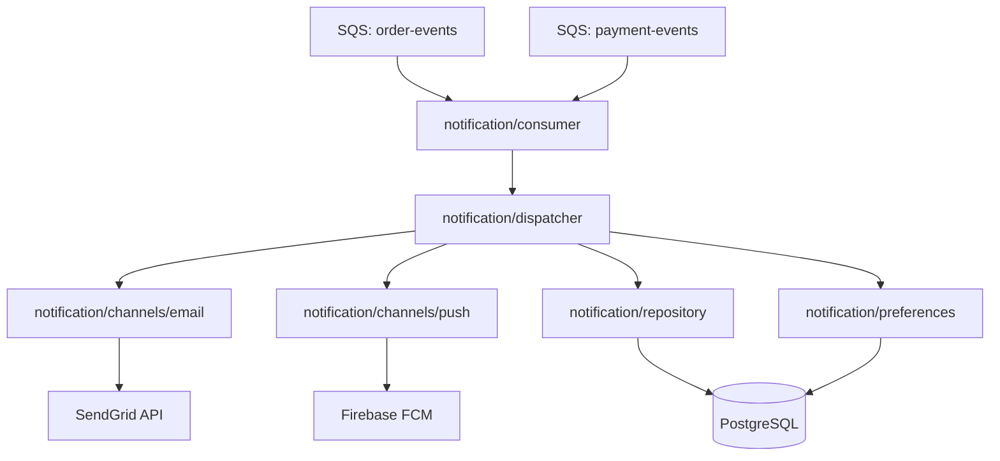
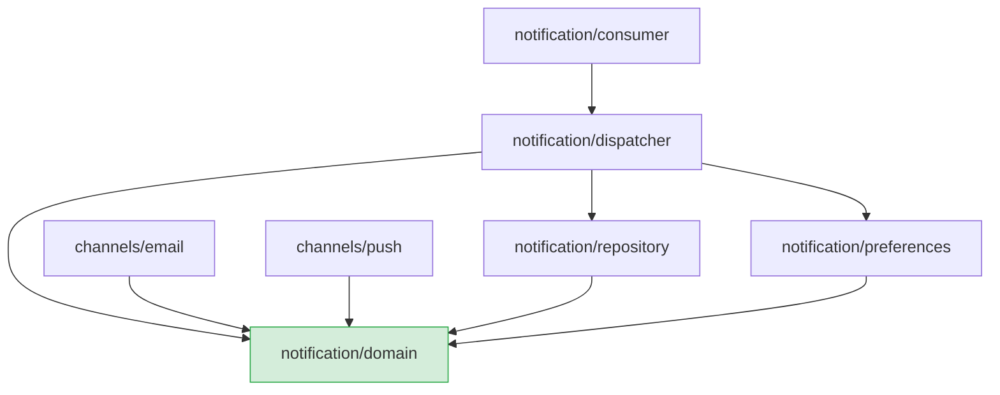
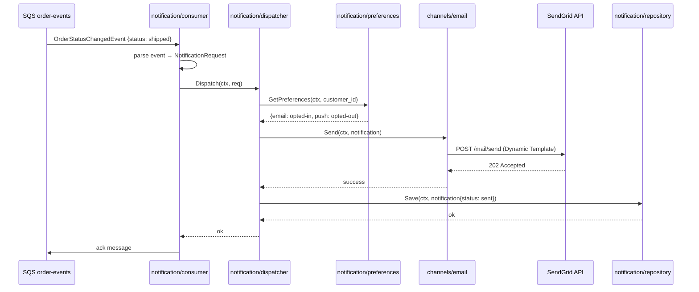
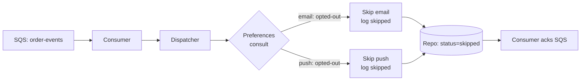

# Example Architecture Spec: Notification Service

> This is a complete example of an architecture tech spec produced by arch.spec.create.
> **Pattern showcased:** event-driven service — consumer-based architecture with SQS,
> multiple notification channels, and a dispatcher pattern.
> Use it as a reference for documenting services that are triggered by events rather
> than direct API calls, and for architectures with multiple outbound integrations.

---

## 1. Overview

- **Name**: Notification Service
- **Scope**: system
- **Status**: Approved
- **Author**: platform-team
- **Created**: 2026-03-15
- **Version**: 1.0.0

## 2. Context & Motivation

User notifications were scattered across the system: the order service sent emails directly via the SendGrid SDK, the payment service sent other emails through a shared utility function, and push notifications had never been implemented due to the lack of a centralized place to do so.

This dispersion caused logic duplication, made it impossible to track notification history in a unified way, and created direct coupling between business logic and provider-specific details.

The Notification Service centralizes all notification delivery. Other services publish events — the Notification Service decides how and when to notify.

## 3. Goals & Constraints

**Architectural Goals:**
- Centralize all notification delivery in a single service
- Decouple producers (order-service, payment-service) from delivery providers (SendGrid, FCM)
- Make notification channels pluggable without changes to producers
- Guarantee complete traceability of all notifications sent

**Constraints:**
- Must consume events from existing SQS queues — cannot require contract changes in producers
- SendGrid is the only contracted email provider; FCM for push is new
- Must run on the existing ECS Fargate cluster (no new compute infrastructure)
- Notification history must respect the data retention policy (90 days)

**Non-Goals:**
- Template management UI (templates are edited directly in SendGrid/FCM dashboards)
- SMS notifications in this version
- Notification scheduling (future-dated delivery)

## 4. High-Level Design

The Notification Service is an SQS consumer that receives domain events from other services, maps them to concrete notifications, and dispatches them to the correct channel via adapters. A central dispatcher decides which channel to use based on the event type and user preferences.

### 4.1 Component Diagram



### 4.2 Component Boundaries

| Component | Responsibility | Public Interface |
|-----------|---------------|-----------------|
| `notification/consumer` | Receives and parses SQS messages; maps to `NotificationRequest` | `Consumer` (polling goroutine) |
| `notification/dispatcher` | Decides channel(s) based on event type and user preferences | `Dispatcher` interface |
| `notification/channels/email` | SendGrid adapter — formats and sends email | `Channel` interface |
| `notification/channels/push` | FCM adapter — formats and sends push notification | `Channel` interface |
| `notification/repository` | Persists and queries notification history | `NotificationRepository` interface |
| `notification/preferences` | Queries user channel preferences (opt-out, preferred channel) | `PreferencesRepository` interface |

## 5. Key Design Decisions

### Decision 1: Dispatcher Pattern with Channel Interface

- **Status**: Accepted
- **Context**: New notification channels (SMS, WhatsApp) may be added in the future. The logic of which channel to use must not be coupled to the adapters themselves.
- **Decision**: A central `Dispatcher` implements the routing logic. Each delivery channel implements the `Channel` interface. The dispatcher receives channels via dependency injection.
- **Rationale**: Adding a new channel only requires implementing `Channel` and registering it with the dispatcher — no changes to routing logic or the consumer.
- **Consequences**: The dispatcher must know all available channels. The routing logic (which event goes to which channel) is centralized in it and may grow complex as new event types and channels are added.

### Decision 2: Consumer Acks Message Regardless of Delivery Failure

- **Status**: Accepted
- **Context**: Delivery failures in SendGrid or FCM must not cause infinite SQS message reprocessing.
- **Decision**: The consumer always acks the SQS message after a dispatch attempt, regardless of the result. Delivery failures are recorded in the database with `status=failed` and can be retried by a separate job if needed.
- **Rationale**: Provider failures are transient and do not justify redelivering the original message. Uncontrolled reprocessing can result in user spam.
- **Consequences**: Failed notifications require active monitoring. A retry job for `status=failed` records must be implemented in a future iteration.

### Decision 3: Channel Preferences Consulted at Runtime

- **Status**: Accepted
- **Context**: Users may have opted out of certain channels (email unsubscribe, push disabled).
- **Decision**: The dispatcher consults `PreferencesRepository` before dispatching to any channel. If the user has opted out of that channel, the send is skipped and recorded as `skipped`.
- **Rationale**: Centralizing preference checks in the dispatcher prevents each adapter from reimplementing opt-out logic.
- **Consequences**: Each dispatch adds a database read for preferences. Consider an in-memory cache with a short TTL if volume is high.

## 6. Architecture Patterns & Conventions

### 6.1 Component Structure

```
notification/
  consumer/
    consumer.go       — SQS polling, message parsing, event routing
    consumer_test.go
  dispatcher/
    dispatcher.go     — NotificationRequest routing to channels
    dispatcher_test.go
  channels/
    channel.go        — Channel interface definition
    email/
      email.go        — SendGrid adapter
      email_test.go
    push/
      push.go         — FCM adapter
      push_test.go
  repository/
    repository.go     — NotificationRepository interface + PostgreSQL impl
  preferences/
    preferences.go    — PreferencesRepository interface + PostgreSQL impl
  domain/
    notification.go   — Notification, NotificationRequest, Status types
    event.go          — Parsed domain event types (OrderStatusChangedEvent, etc.)
```

### 6.2 Dependency Direction



**Forbidden:** `notification/domain` must not import from any other internal package. `consumer` must not know channels directly — only `dispatcher`.

### 6.3 Communication Style

- `consumer → dispatcher`: synchronous Go function call within the same processing goroutine
- `dispatcher → channels`: synchronous calls via the `Channel` interface; the dispatcher waits for each channel result before recording
- `dispatcher → repository / preferences`: synchronous calls via injected interfaces
- `consumer ← SQS`: async polling every 5s; up to 10 messages per batch

### 6.4 Error Handling Strategy

- Provider errors (SendGrid/FCM) are logged and the `failed` result is persisted — they do not propagate to the consumer
- Database errors (repository/preferences) propagate to the dispatcher, then to the consumer — the consumer logs and acks the message regardless (see Decision 2)
- SQS message parsing errors (unknown or malformed event) result in an immediate ack with a `WARN` log — they do not block the batch

## 7. Data Flow

### Flow 1: Order shipped notification (email opted-in)



### Flow 2: User with email opt-out



## 8. External Integrations & Dependencies

| Dependency | Type | Purpose | Owned by |
|-----------|------|---------|---------|
| SQS `order-events` | AWS Managed | Order status change events | Order Service team |
| SQS `payment-events` | AWS Managed | Payment events (confirmed, refunded) | Payment Service team |
| SendGrid API | External HTTP | Transactional email delivery | Vendor (existing contract) |
| Firebase FCM | External HTTP | Mobile push notification delivery | Vendor (new) |
| PostgreSQL | Infrastructure | Notification history and preferences | Platform team |

## 9. Non-Functional Requirements & Strategies

| Attribute | Requirement | Strategy |
|-----------|------------|---------|
| Testability | Dispatcher logic must be 100% testable without external providers | Dependency inversion; `Channel` is a mockable interface |
| Traceability | Every send attempt (sent/failed/skipped) must be auditable | Persist to `notifications` table with status and timestamps |
| Data retention | Notification data retained for at most 90 days | Daily purge job on `notifications.created_at` |
| Resilience | SendGrid failure must not stop queue processing | Consumer always acks; failures recorded for manual retry |
| Observability | Metrics for sent/failed/skipped by channel and event type | Structured logging with `event_type`, `channel`, `status` |

## 10. Open Questions

- [ ] [TODO: decide — implement in-memory preferences cache with TTL? If yes, what TTL is acceptable given that opt-out must take effect immediately]
- [ ] [TODO: decide — retry job for `failed` notifications: frequency, maximum retry attempts, and abandonment criteria]
