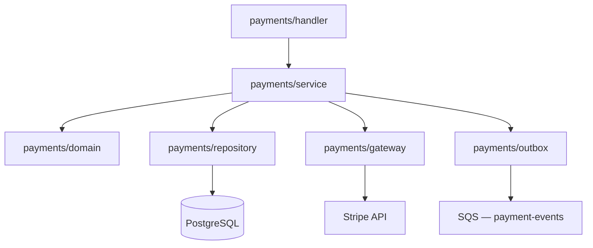
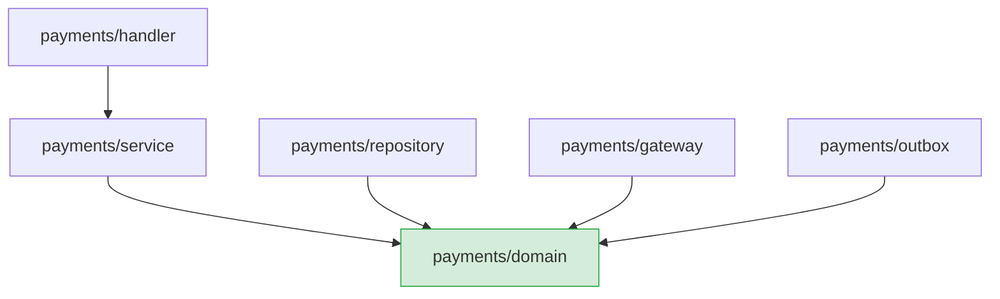
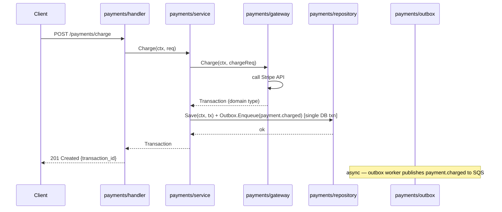
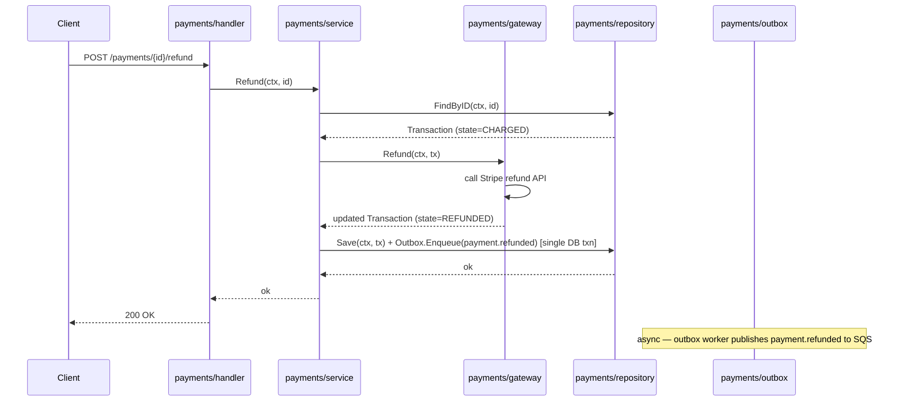

# Example Architecture Spec: Payments Module

> This is a complete example of an architecture tech spec produced by arch.spec.create.
> Use it as a reference for output structure, level of detail, ADR format, and writing style.

---

## 1. Overview

- **Name**: Payments Module
- **Scope**: module
- **Status**: Approved
- **Author**: platform-team
- **Created**: 2026-01-15
- **Version**: 1.1.0

## 2. Context & Motivation

The payments module handles all financial transactions in the platform: charge initiation, payment provider integration, refunds, and transaction history. Prior to this architecture, payment logic was scattered across the order service and user service with direct SDK calls to the payment provider embedded throughout the codebase.

The goal of this architecture is to isolate all payment concerns behind a single module boundary, enforce a clean dependency direction, and make the payment provider swappable without touching business logic.

## 3. Goals & Constraints

**Architectural Goals:**
- Isolate payment provider details behind an anti-corruption layer
- Keep domain logic (charge rules, refund policies) independent of infrastructure (HTTP clients, SDKs)
- Make the payment provider swappable without changes to business rules
- Ensure all transaction state transitions are explicit and auditable

**Constraints:**
- Must integrate with Stripe as the initial payment provider (existing contract)
- Cannot break the existing `Order` domain model — payments reference orders but do not own them
- Must run within the existing ECS Fargate deployment (no new infrastructure)
- All payment events must be persisted before being published (outbox pattern required)

**Non-Goals:**
- Fraud detection — handled by Stripe; not duplicated here
- Multi-currency conversion — deferred to a future iteration
- Subscription billing — out of scope for this module

## 4. High-Level Design

The payments module is structured around a domain core (charge rules, transaction state machine) surrounded by ports. Infrastructure adapters implement those ports. No infrastructure concern imports from the domain.

### 4.1 Component Diagram



### 4.2 Component Boundaries

| Component | Responsibility | Public Interface |
|-----------|---------------|-----------------|
| `payments/handler` | HTTP request handling, input validation, response mapping | `PaymentHandler` (HTTP handlers) |
| `payments/service` | Orchestrates charge and refund flows, enforces business rules | `PaymentService` interface |
| `payments/domain` | Transaction state machine, charge validation rules | `Transaction`, `ChargePolicy` types |
| `payments/repository` | Persist and query transaction records | `TransactionRepository` interface |
| `payments/gateway` | Anti-corruption layer for Stripe SDK | `PaymentGateway` interface |
| `payments/outbox` | Reliable event publishing via transactional outbox | `OutboxPublisher` interface |

## 5. Key Design Decisions

### Decision 1: Anti-Corruption Layer for Payment Provider

- **Status**: Accepted
- **Context**: Stripe's SDK surface is large and changes frequently. Embedding Stripe types directly in the service layer would couple business logic to a third-party contract.
- **Decision**: All Stripe interactions are encapsulated in `payments/gateway`. The `PaymentGateway` interface uses domain types only. The Stripe adapter maps between domain and Stripe types internally.
- **Rationale**: Allows swapping Stripe for another provider (e.g., Adyen) by implementing a new adapter without changing `PaymentService` or domain logic.
- **Consequences**: Adds a translation layer. Stripe-specific error codes must be mapped to domain errors — this mapping must be maintained when Stripe releases breaking changes.

### Decision 2: Transactional Outbox for Payment Events

- **Status**: Accepted
- **Context**: Payment state changes (charged, refunded, failed) must be communicated to other services (order service, notification service). Publishing directly to SQS after a DB write risks losing events if the process crashes between the two operations.
- **Decision**: Payment events are written to an `outbox` table in the same PostgreSQL transaction as the transaction record. A background worker reads the outbox and publishes to SQS, then marks events as published.
- **Rationale**: Guarantees at-least-once delivery without distributed transactions. Eliminates the dual-write problem.
- **Consequences**: Requires an outbox worker process. Events may be published more than once — consumers must be idempotent.

### Decision 3: Dependency Direction (Domain Independence)

- **Status**: Accepted
- **Context**: Previous codebase mixed infrastructure imports into domain files, making unit testing painful and creating tight coupling.
- **Decision**: Dependency direction is strictly: `handler → service → domain`. Infrastructure components (`repository`, `gateway`, `outbox`) depend on domain interfaces, never the reverse. The domain package has zero external imports.
- **Rationale**: Domain logic is unit-testable with no mocks required for external systems. Infrastructure is replaceable.
- **Consequences**: All external dependencies must be injected. The service layer wires everything together via dependency injection at startup.

## 6. Architecture Patterns & Conventions

### 6.1 Component Structure

Each component follows this internal layout:

```
payments/
  handler/
    handler.go       — HTTP handlers
    handler_test.go
  service/
    service.go       — PaymentService implementation
    service_test.go
  domain/
    transaction.go   — Transaction type and state machine
    policy.go        — ChargePolicy rules
  repository/
    repository.go    — TransactionRepository interface + PostgreSQL impl
  gateway/
    gateway.go       — PaymentGateway interface
    stripe.go        — Stripe adapter
  outbox/
    outbox.go        — OutboxPublisher interface + implementation
    worker.go        — Background polling worker
```

### 6.2 Dependency Direction



**Forbidden:** `payments/domain` must never import from `handler`, `repository`, `gateway`, or `outbox`.

### 6.3 Communication Style

- `handler → service`: direct synchronous Go function calls
- `service → repository / gateway / outbox`: synchronous calls via injected interfaces
- `outbox → SQS`: asynchronous; outbox worker polls at 5s interval

### 6.4 Error Handling Strategy

- Domain errors are typed (`ErrInsufficientFunds`, `ErrTransactionNotFound`, etc.) and defined in `payments/domain`
- Gateway maps Stripe errors to domain errors before returning to the service layer
- Handler maps domain errors to HTTP status codes; no Stripe types ever reach the HTTP response
- All unexpected errors are wrapped with context using `fmt.Errorf("...: %w", err)` and logged at ERROR level

## 7. Data Flow

### Flow 1: Charge a Payment



### Flow 2: Refund a Payment



## 8. External Integrations & Dependencies

| Dependency | Type | Purpose | Owned by |
|-----------|------|---------|---------|
| Stripe API | External HTTP API | Payment processing (charge, refund, retrieve) | Stripe (vendor) |
| PostgreSQL | Infrastructure | Transaction records and outbox table | Platform team |
| SQS (`payment-events`) | AWS Managed | Async event publishing for downstream consumers | Platform team |

## 9. Non-Functional Requirements & Strategies

| Attribute | Requirement | Strategy |
|-----------|------------|---------|
| Testability | Domain logic must be 100% unit-testable with no external dependencies | Dependency inversion; domain has no external imports |
| Reliability | No payment event loss on process crash | Transactional outbox pattern |
| Maintainability | Payment provider must be swappable in < 1 day | Anti-corruption layer (`payments/gateway`) |
| Observability | All transaction state changes must be traceable | Structured logging with `transaction_id` on every log entry |
| Performance | `POST /payments/charge` < 500ms p95 | Stripe is the bottleneck; no additional latency introduced by this module |

## 10. Open Questions

- [ ] [TODO: decide — should the outbox worker run as a sidecar container or as a goroutine within the same process? Implications: sidecar is more operationally isolated but requires separate deployment; goroutine is simpler but couples lifecycle to the main process]
