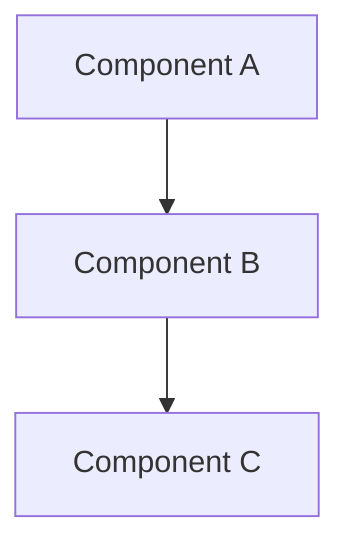
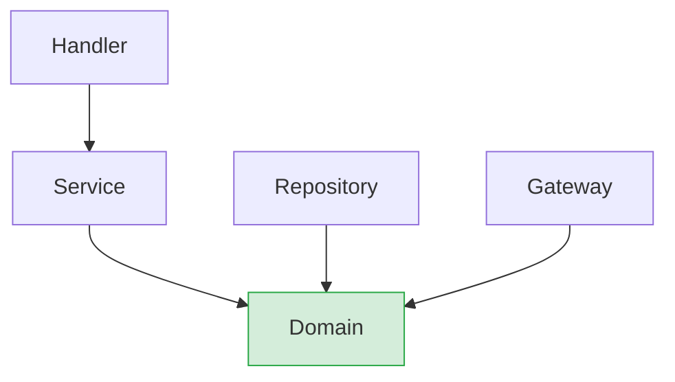
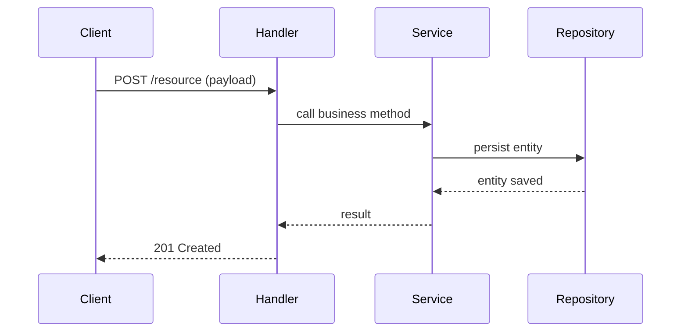
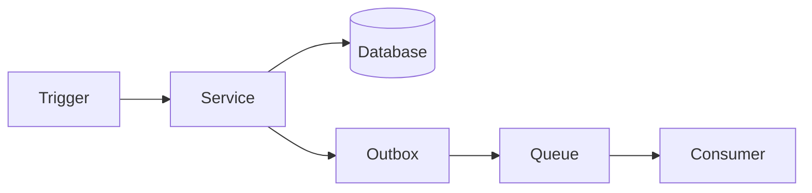

# Architecture Tech Spec Template

Use this template when creating a new architecture tech spec. Fill all sections with concrete content; use `[TODO: ...]` only when information requires a human decision.

---

## 1. Overview

- **Name**: System / module name
- **Scope**: system | module | layer | integration
- **Status**: Draft | Review | Approved
- **Author**: (infer from git config or leave blank)
- **Created**: (today's date)
- **Version**: 1.0.0

## 2. Context & Motivation

Why does this architecture exist? What problem does it solve? What drove the design decisions?
Include a brief description of the business or technical context.

## 3. Goals & Constraints

**Architectural Goals:**
- List quality attributes being optimized (e.g., maintainability, scalability, testability)

**Constraints:**
- Technology or platform constraints
- Team or organizational constraints
- Non-functional requirements (performance SLAs, security requirements)

**Non-Goals:**
- What this architecture intentionally does not address

## 4. High-Level Design

Describe the overall structure in prose. Explain the main building blocks and how they relate.

### 4.1 Component Diagram (ASCII or Mermaid)

### 4.2 Component Boundaries

| Component | Responsibility | Public Interface |
|-----------|---------------|-----------------|
| `component-a` | ... | `ServiceA` |
| `component-b` | ... | `RepositoryB` |

## 5. Key Design Decisions

Document significant architectural decisions using ADR format:

### Decision 1: [Short title]

- **Status**: Accepted | Proposed | Deprecated
- **Context**: Why was this decision needed?
- **Decision**: What was decided?
- **Rationale**: Why this option over alternatives?
- **Consequences**: What are the trade-offs and implications?

### Decision 2: [Short title]

*(repeat as needed)*

## 6. Architecture Patterns & Conventions

### 6.1 Component Structure

Describe the standard layout and organization for components in this system.

### 6.2 Dependency Direction

Define the allowed dependency flow between layers or components. Use a Mermaid `flowchart TD` to make allowed and forbidden directions explicit:

> Add a note below the diagram listing any explicitly **forbidden** dependencies (e.g., "Domain must never import from Repository, Gateway, or Handler").

### 6.3 Communication Style

How do components communicate? (e.g., direct calls, events, message queues, REST, gRPC)

### 6.4 Error Handling Strategy

How errors propagate across boundaries and how they are surfaced to consumers.

## 7. Data Flow

Describe 1–3 key flows with enough detail to understand runtime behavior. Use Mermaid diagrams — do not use plain text arrows.

- Use `sequenceDiagram` for synchronous request/response flows
- Use `flowchart LR` when the flow involves async steps, queues, events, or conditional branching

### Flow 1: [Name of the primary flow]

### Flow 2: [Name of an async or event-driven flow, if applicable]

## 8. External Integrations & Dependencies

| Dependency | Type | Purpose | Owned by |
|-----------|------|---------|---------|
| PostgreSQL | Infrastructure | Primary data store | Platform team |
| Auth Service | External API | Token validation | Identity team |

## 9. Non-Functional Requirements & Strategies

| Attribute | Requirement | Strategy |
|-----------|------------|---------|
| Testability | Business logic must be unit-testable | Dependency inversion, pure functions |
| Maintainability | Low coupling between components | Defined interfaces, bounded contexts |
| Performance | < 200ms p95 response time | [TODO: define strategy] |

## 10. Open Questions

- [ ] [TODO: question]
