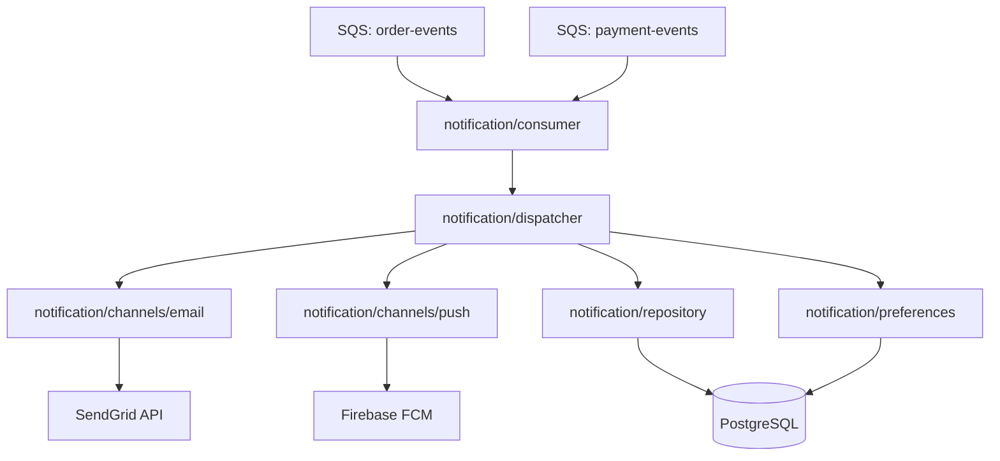
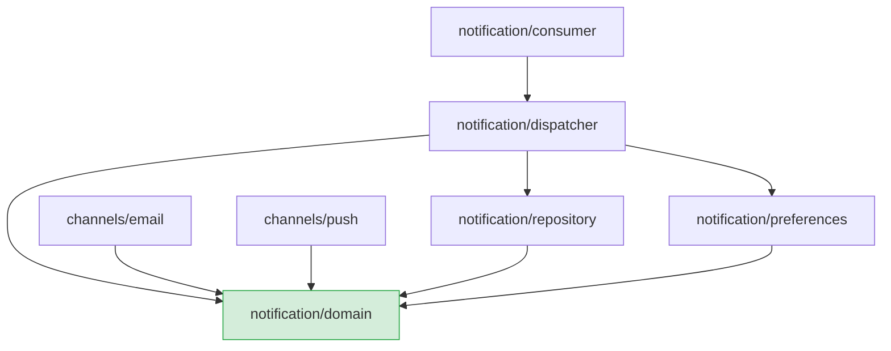
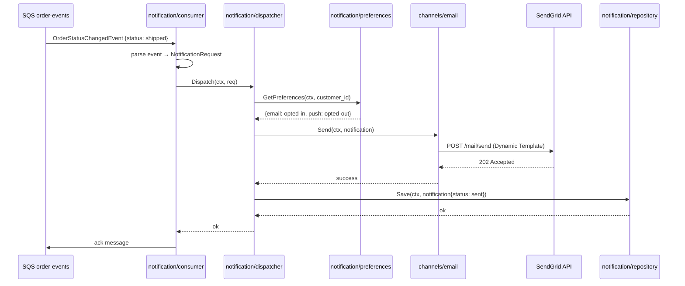
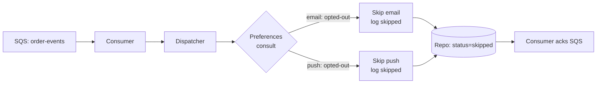

# Example Architecture Spec: Notification Service

> This is a complete example of an architecture tech spec produced by arch.ts.create.
> **Pattern showcased:** event-driven service — consumer-based architecture with SQS,
> multiple notification channels, and a dispatcher pattern.
> Use it as a reference for documenting services that are triggered by events rather
> than direct API calls, and for architectures with multiple outbound integrations.

---

## 1. Overview

- **Name**: Notification Service
- **Scope**: system
- **Status**: Approved
- **Author**: platform-team
- **Created**: 2026-03-15
- **Version**: 1.0.0

## 2. Context & Motivation

Notificações ao usuário estavam espalhadas pelo sistema: o serviço de pedidos enviava emails diretamente via SendGrid SDK, o serviço de pagamentos enviava outros emails via uma função utilitária compartilhada, e notificações push nunca foram implementadas por falta de um lugar centralizado.

Essa dispersão causou duplicação de lógica, impossibilidade de rastrear o histórico de notificações de forma unificada, e acoplamento direto entre lógica de negócio e detalhes de provedores de envio.

O Notification Service centraliza toda entrega de notificações. Outros serviços publicam eventos — o Notification Service decide como e quando notificar.

## 3. Goals & Constraints

**Architectural Goals:**
- Centralizar toda entrega de notificações em um único serviço
- Desacoplar produtores (order-service, payment-service) de provedores de entrega (SendGrid, FCM)
- Tornar canais de notificação plugáveis sem mudança nos produtores
- Garantir rastreabilidade completa de todas as notificações enviadas

**Constraints:**
- Deve consumir eventos de filas SQS existentes — não pode exigir mudança de contrato nos produtores
- SendGrid é o único provider de email contratado; FCM para push é novo
- Deve rodar no ECS Fargate existente (sem nova infraestrutura de compute)
- Histórico de notificações deve respeitar política de retenção LGPD (90 dias)

**Non-Goals:**
- Gerenciamento de templates via UI (editado diretamente no SendGrid/FCM dashboards)
- Notificações por SMS nesta versão
- Scheduling de notificações (envio agendado para horário futuro)

## 4. High-Level Design

O Notification Service é um consumer SQS que recebe eventos de domínio de outros serviços, os mapeia para notificações concretas, e os despacha para o canal correto via adapters. Um dispatcher central decide qual canal usar com base no tipo de evento e nas preferências do usuário.

### 4.1 Component Diagram



### 4.2 Component Boundaries

| Component | Responsibility | Public Interface |
|-----------|---------------|-----------------|
| `notification/consumer` | Recebe e parseia mensagens SQS; mapeia para `NotificationRequest` | `Consumer` (goroutine de polling) |
| `notification/dispatcher` | Decide canal(is) com base no tipo de evento e preferências do usuário | `Dispatcher` interface |
| `notification/channels/email` | Adapter para SendGrid — formata e envia email | `Channel` interface |
| `notification/channels/push` | Adapter para FCM — formata e envia push | `Channel` interface |
| `notification/repository` | Persiste e consulta histórico de notificações | `NotificationRepository` interface |
| `notification/preferences` | Consulta preferências de canal do usuário (opt-out, canal preferido) | `PreferencesRepository` interface |

## 5. Key Design Decisions

### Decision 1: Dispatcher Pattern com Interface de Canal

- **Status**: Accepted
- **Context**: Novos canais de notificação (SMS, WhatsApp) podem ser adicionados no futuro. A lógica de qual canal usar não deve estar acoplada aos adapters.
- **Decision**: Um `Dispatcher` central implementa a lógica de roteamento. Cada canal de entrega implementa a interface `Channel`. O dispatcher recebe os canais por injeção de dependência.
- **Rationale**: Adicionar um novo canal requer apenas implementar `Channel` e registrá-lo no dispatcher — sem tocar na lógica de roteamento nem no consumer.
- **Consequences**: O dispatcher precisa conhecer todos os canais disponíveis. A lógica de roteamento (qual evento vai para qual canal) fica centralizada nele e pode se tornar complexa à medida que novos tipos de evento e canais são adicionados.

### Decision 2: Consumer Confirma Mensagem Independente de Falha de Envio

- **Status**: Accepted
- **Context**: Falhas de entrega no SendGrid ou FCM não devem causar reprocessamento infinito da mensagem SQS.
- **Decision**: O consumer sempre confirma (`ack`) a mensagem SQS após tentativa de dispatch, independente do resultado. Falhas de envio são registradas no banco com `status=failed` e podem ser reprocessadas por um job separado se necessário.
- **Rationale**: Falhas de provider são transitórias e não justificam reentrega da mensagem original. Reprocessamento sem controle pode causar spam ao usuário.
- **Consequences**: Notificações com falha precisam de monitoramento ativo. Um job de retry para `status=failed` deve ser implementado em iteração futura.

### Decision 3: Preferências de Canal Consultadas em Runtime

- **Status**: Accepted
- **Context**: Usuários podem ter optado por não receber determinados canais (opt-out de email, desabilitado push).
- **Decision**: O dispatcher consulta `PreferencesRepository` antes de despachar para qualquer canal. Se o usuário optou por não receber naquele canal, o envio é pulado e registrado como `skipped`.
- **Rationale**: Centralizar a verificação de preferências no dispatcher evita que cada adapter precise reimplementar a lógica de opt-out.
- **Consequences**: Cada dispatch adiciona uma leitura ao banco de preferências. Considerar cache em memória com TTL curto se o volume for alto.

## 6. Architecture Patterns & Conventions

### 6.1 Component Structure

```
notification/
  consumer/
    consumer.go       — SQS polling, message parsing, event routing
    consumer_test.go
  dispatcher/
    dispatcher.go     — NotificationRequest routing to channels
    dispatcher_test.go
  channels/
    channel.go        — Channel interface definition
    email/
      email.go        — SendGrid adapter
      email_test.go
    push/
      push.go         — FCM adapter
      push_test.go
  repository/
    repository.go     — NotificationRepository interface + PostgreSQL impl
  preferences/
    preferences.go    — PreferencesRepository interface + PostgreSQL impl
  domain/
    notification.go   — Notification, NotificationRequest, Status types
    event.go          — Parsed domain event types (OrderStatusChangedEvent, etc.)
```

### 6.2 Dependency Direction



**Forbidden:** `notification/domain` não importa de nenhum outro pacote interno. `consumer` não conhece canais diretamente — apenas `dispatcher`.

### 6.3 Communication Style

- `consumer → dispatcher`: chamada Go síncrona dentro da mesma goroutine de processamento
- `dispatcher → channels`: chamadas síncronas via interface `Channel`; o dispatcher espera resultado de cada canal antes de registrar
- `dispatcher → repository / preferences`: chamadas síncronas via interfaces injetadas
- `consumer ← SQS`: polling assíncrono a cada 5s; até 10 mensagens por batch

### 6.4 Error Handling Strategy

- Erros de provider (SendGrid/FCM) são logados e o resultado `failed` é persistido — não propagam para o consumer
- Erros de banco (repository/preferences) são propagados para o dispatcher, que os propaga para o consumer — o consumer loga e confirma a mensagem mesmo assim (ver Decision 2)
- Erros de parsing de mensagem SQS (evento desconhecido ou malformado) resultam em `ack` imediato com log de `WARN` — não bloqueiam o batch

## 7. Data Flow

### Flow 1: Notificação de pedido enviado (email)



### Flow 2: Usuário com opt-out de email



## 8. External Integrations & Dependencies

| Dependency | Type | Purpose | Owned by |
|-----------|------|---------|---------|
| SQS `order-events` | AWS Managed | Eventos de mudança de status de pedidos | Order Service team |
| SQS `payment-events` | AWS Managed | Eventos de pagamento (confirmado, estornado) | Payment Service team |
| SendGrid API | External HTTP | Entrega de emails transacionais | Vendor (contrato existente) |
| Firebase FCM | External HTTP | Entrega de notificações push mobile | Vendor (novo) |
| PostgreSQL | Infrastructure | Histórico de notificações e preferências | Platform team |

## 9. Non-Functional Requirements & Strategies

| Attribute | Requirement | Strategy |
|-----------|------------|---------|
| Testabilidade | Lógica de dispatcher 100% testável sem providers externos | Dependency inversion; Channel é interface mockável |
| Rastreabilidade | Todo envio (sent/failed/skipped) deve ser auditável | Persistência em `notifications` com status e timestamps |
| LGPD | Dados de notificação retidos por no máximo 90 dias | Job de purge diário sobre `notifications.created_at` |
| Resiliência | Falha do SendGrid não deve parar o processamento da fila | Consumer faz ack sempre; falhas registradas para retry manual |
| Observabilidade | Métricas de sent/failed/skipped por canal e tipo de evento | Structured logging com `event_type`, `channel`, `status` |

## 10. Open Questions

- [ ] [TODO: decide — implementar cache de preferências em memória com TTL? Se sim, qual TTL aceitável considerando que opt-out deve ter efeito imediato]
- [ ] [TODO: decide — job de retry para notificações `failed`: frequência, número máximo de tentativas, e critério de abandono]
