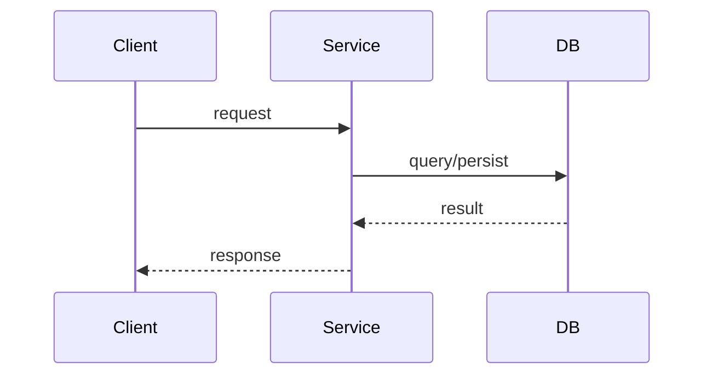

# Spec Template

Use this template when creating a new spec document. Fill all sections with concrete content; use `[TODO: describe ...]` only when information requires a human decision.

---

## 1. Overview

- **Title**: Clear, concise feature title
- **Status**: Draft | Review | Approved
- **Author**: (infer from git config or leave blank)
- **Created**: (today's date)
- **Version**: 1.0.0

## 2. Problem Statement

Describe the problem this feature/story solves. Be clear and objective.

## 3. Goals & Non-Goals

**Goals:**
- List what this spec intends to achieve

**Non-Goals:**
- List what is explicitly out of scope

## 4. Proposed Solution

High-level description of the proposed approach.

## 5. Technology Decisions

Explicit record of technology choices made for this feature. Every row must have a clear **Decision** — no implicit choices.

| Concern | Decision | Alternatives Considered | Rationale |
|---------|----------|------------------------|-----------|
| Data storage | e.g. PostgreSQL (existing users DB) | DynamoDB, Redis | Already in use; relational model fits |
| API style | e.g. REST — POST /resource | GraphQL, gRPC | Team convention |
| Auth | e.g. JWT via existing middleware | OAuth, API key | Consistent with rest of API |
| Async processing | e.g. None — synchronous | SQS, background job | Low volume, latency acceptable |
| Infrastructure | e.g. ECS Fargate (existing cluster) | Lambda, EC2 | Follows service deployment standard |

> Use `[TODO: decide — options: A, B, C]` for any row where the decision is not yet made.

## 6. Detailed Design

### 6.1 API / Interface

Define public interfaces, function signatures, or API contracts.

```go
// Interface definitions go here — adapt to project language:
// TypeScript: export interface ServiceName { methodName(input: InputType): Promise<OutputType> }
// Python:     class ServiceName(Protocol): def method_name(self, input: InputType) -> OutputType: ...
// Java:       public interface ServiceName { OutputType methodName(InputType input); }
type ServiceName interface {
    MethodName(ctx context.Context, input InputType) (OutputType, error)
}
```

### 6.2 Data Model

Describe any new or modified data structures, schemas, or types.

```go
// Type/data model definitions go here — adapt to project language:
// TypeScript: export interface EntityName { id: string; createdAt: Date }
// Python:     @dataclass class EntityName: id: str; created_at: datetime
// Java:       public record EntityName(String id, Instant createdAt) {}
type EntityName struct {
    ID        string    `json:"id"`
    CreatedAt time.Time `json:"created_at"`
}
```

### 6.3 Behavior & Logic

Step-by-step description of how the solution works.

> Add a Mermaid diagram here when behavior involves a multi-step flow (3+ steps, 2+ components),
> state transitions, or async processing. Use `sequenceDiagram` for request/response,
> `stateDiagram-v2` for state machines, or `flowchart LR` for async/event flows.
> Omit if the prose is already unambiguous without a diagram.



## 7. Acceptance Criteria

Each criterion must follow **Given/When/Then** format and be specific enough to implement as a direct test case without interpretation.

- [ ] **Given** [context], **When** [action], **Then** [observable result]
- [ ] **Given** [context], **When** [action], **Then** [observable result]
- [ ] **Given** [context], **When** [action], **Then** [observable result]

> Include at minimum: 1 happy-path criterion and 1 error or edge-case criterion.
>
> **Security criterion (conditional):** if the Security item in section 8 has any
> applicable (non-`N/A`) entry — authorization, sensitive data, untrusted input, or
> an abuse case — include at least one criterion asserting a *negative* outcome:
> a non-owner receiving `404`, an unauthorized role receiving `403`, malformed input
> rejected. State the exact status code and that no protected data appears in the
> response body.

## 8. Technical Considerations

- **Performance implications**
- **Security** — required. For each item below, describe the handling or write `N/A — <reason>`:
  - *Untrusted input* — where external input (request body, path/query params, uploads, headers) enters and how it is validated or sanitized
  - *Authentication* — which check gates this feature; behavior with missing or invalid credentials
  - *Authorization* — who may invoke it; the per-resource (ownership) or per-role check and where in the flow it runs
  - *Sensitive data* — PII, credentials, tokens, or financial data touched, and how it is stored, logged, and transmitted
  - *Abuse case* — one malicious-use scenario and how the design resists it. Common shapes:
    - **IDOR** (Insecure Direct Object Reference) — a caller swaps an `id` in the request to read or modify a resource that belongs to someone else, because the handler looks it up by `id` alone and never checks ownership
    - **Enumeration** — a caller probes sequential or guessable `id`s / emails and tells valid from invalid apart by a different status code, error body, or response time
    - **Replay** — a caller captures a valid request (or token) and resends it to repeat an effect that should happen only once
    - **Injection** — untrusted input is interpolated into a query, command, path, or template instead of being passed as a bound parameter
- **Dependencies and integrations**
- **Breaking changes (if any)**

> If the Security item has any applicable (non-`N/A`) entry, section 7 must contain the
> matching security acceptance criterion.

## 9. Open Questions

List unresolved questions that require decisions before or during implementation.
