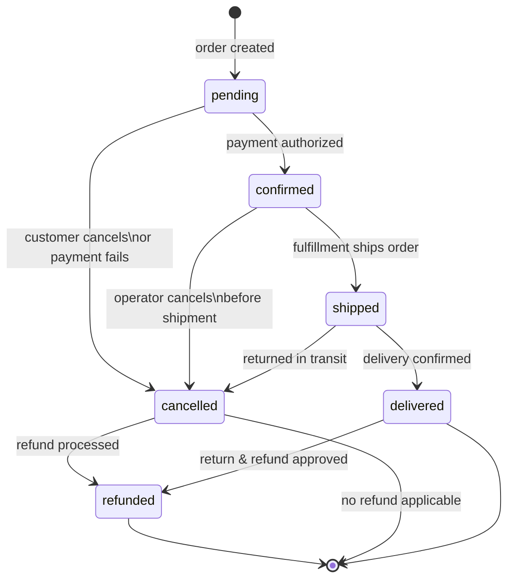

# Example Spec: Order Lifecycle State Machine

> This is a complete example of a spec produced by spec.create.
> **Diagram type showcased:** `stateDiagram-v2` — use this pattern when the behavior is
> fundamentally about state transitions: which states exist, which transitions are valid,
> and what triggers each transition.

---

## 1. Overview

- **Title**: Order Lifecycle State Machine
- **Status**: Approved
- **Author**: commerce-team
- **Created**: 2026-03-10
- **Version**: 1.0.0

## 2. Problem Statement

The order lifecycle is currently implicit in the code — there is no transition validation, which allows inconsistent states (e.g., a cancelled order being marked as delivered). This has caused production incidents where orders entered invalid states and generated duplicate charges or incorrect notifications.

## 3. Goals & Non-Goals

**Goals:**
- Formally define all possible order states and valid transitions between them
- Introduce transition validation that prevents invalid states at runtime
- Make the lifecycle auditable — every transition must be recorded with a timestamp and actor

**Non-Goals:**
- Reprocessing orders already in an invalid state in the database (separate migration)
- Operator-facing state management UI (deferred)
- Marketplace order states (different scope)

## 4. Proposed Solution

Implement an `OrderStateMachine` in the domain layer that encapsulates all valid transitions. Every status change must go through the state machine — direct access to the `status` field outside the domain is forbidden. Each transition persists a record in `order_status_history`.

## 5. Technology Decisions

| Concern | Decision | Alternatives Considered | Rationale |
|---------|----------|------------------------|-----------|
| State machine implementation | Pure Go (transition map) | External library (looplab/fsm) | Simple logic; no external dependency; easier to test |
| History persistence | `order_status_history` table in existing PostgreSQL | Events in SQS, no history | Synchronous audit trail; simplifies debugging and support |
| Transition validation | Typed domain error (`ErrInvalidTransition`) | Panic, generic error | Allows explicit handling by the handler; no surprises in production |

## 6. Detailed Design

### 6.1 API / Interface

```go
// OrderStateMachine defines the contract for the order state machine
type OrderStateMachine interface {
    Transition(ctx context.Context, order *Order, to OrderStatus, actor string) error
    CanTransition(from, to OrderStatus) bool
}

type OrderStatus string

const (
    StatusPending    OrderStatus = "pending"
    StatusConfirmed  OrderStatus = "confirmed"
    StatusShipped    OrderStatus = "shipped"
    StatusDelivered  OrderStatus = "delivered"
    StatusCancelled  OrderStatus = "cancelled"
    StatusRefunded   OrderStatus = "refunded"
)

var ErrInvalidTransition = errors.New("invalid order status transition")
```

### 6.2 Data Model

New table `order_status_history`:

```go
type OrderStatusHistory struct {
    ID         string      `db:"id"`
    OrderID    string      `db:"order_id"`
    FromStatus OrderStatus `db:"from_status"`
    ToStatus   OrderStatus `db:"to_status"`
    Actor      string      `db:"actor"`       // user_id or "system"
    OccurredAt time.Time   `db:"occurred_at"`
}
```

### 6.3 Behavior & Logic



**Allowed transitions (source of truth):**

| From | To | Allowed actor |
|------|----|---------------|
| `pending` | `confirmed` | system (payment callback) |
| `pending` | `cancelled` | customer, system |
| `confirmed` | `shipped` | system (fulfillment) |
| `confirmed` | `cancelled` | operator |
| `shipped` | `delivered` | system (delivery callback) |
| `shipped` | `cancelled` | operator (returned in transit) |
| `cancelled` | `refunded` | system (refund callback) |
| `delivered` | `refunded` | operator (approved return) |

Any transition not listed above returns `ErrInvalidTransition`.

## 7. Acceptance Criteria

- [ ] `OrderStateMachine.Transition` returns `ErrInvalidTransition` for any transition not in the table above
- [ ] Every valid transition persists a record in `order_status_history` with `from_status`, `to_status`, `actor`, and `occurred_at`
- [ ] It is not possible to modify `order.Status` directly outside of `OrderStateMachine.Transition`
- [ ] `CanTransition(from, to)` returns `true` only for transitions in the table above
- [ ] Transitioning from `delivered` to `shipped` returns `ErrInvalidTransition` (regression forbidden)
- [ ] Transitioning from `cancelled` to any state except `refunded` returns `ErrInvalidTransition`

## 8. Technical Considerations

- **Concurrency:** two simultaneous requests may attempt to transition the same order. Mitigation: use `SELECT FOR UPDATE` when loading the order before applying the transition.
- **Breaking changes:** the `status` field on the `Order` type must become private (accessible only via `StateMachine`). This breaks direct readers — all callers must be migrated.
- **Dependencies:** no new external dependencies.
- **Testability:** `OrderStateMachine` has no external dependencies — can be tested with 100% coverage without mocks.

## 9. Open Questions

- [ ] [TODO: decide — when an invalid transition is attempted, should it be logged as WARNING or ERROR? Operators occasionally attempt invalid transitions due to inconsistent UI]
- [ ] [TODO: decide — should the status history be exposed via API to the customer? If yes, define the endpoint and returned fields]
