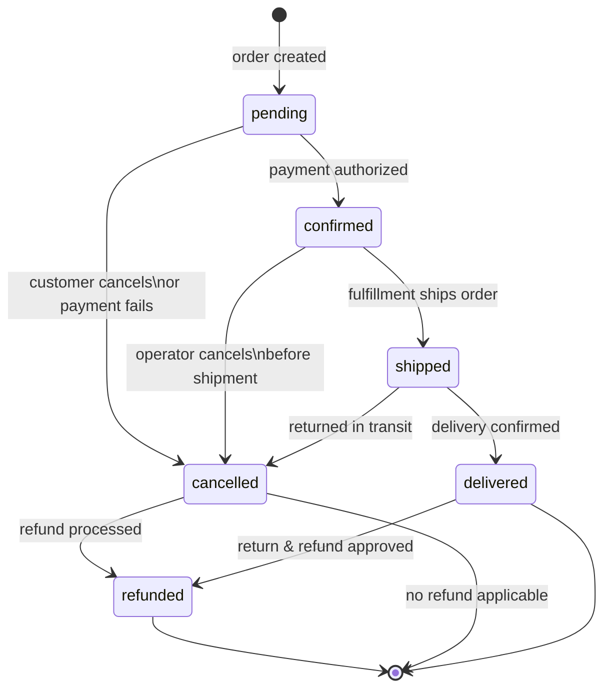

# Example Spec: Order Lifecycle State Machine

> This is a complete example of a spec produced by spec.create.
> **Diagram type showcased:** `stateDiagram-v2` — use this pattern when the behavior is
> fundamentally about state transitions: which states exist, which transitions are valid,
> and what triggers each transition.

---

## 1. Overview

- **Title**: Order Lifecycle State Machine
- **Status**: Approved
- **Author**: commerce-team
- **Created**: 2026-03-10
- **Version**: 1.0.0

## 2. Problem Statement

O ciclo de vida de um pedido está atualmente implícito no código — não há validação de transições, o que permite estados inconsistentes (ex: pedido cancelado sendo marcado como entregue). Isso causou incidentes de produção onde pedidos entraram em estados inválidos e geraram cobranças duplicadas ou notificações incorretas.

## 3. Goals & Non-Goals

**Goals:**
- Definir formalmente todos os estados possíveis de um pedido e as transições válidas entre eles
- Introduzir validação de transição que impeça estados inválidos em tempo de execução
- Tornar o ciclo de vida auditável — cada transição deve ser registrada com timestamp e ator

**Non-Goals:**
- Reprocessamento de pedidos já em estado inválido no banco (migração separada)
- UI de gerenciamento de estado para operadores (deferred)
- Estados de pedidos de marketplace (escopo diferente)

## 4. Proposed Solution

Implementar uma `OrderStateMachine` no domínio que encapsula todas as transições válidas. Toda mudança de status passa obrigatoriamente pela state machine — acesso direto ao campo `status` fora do domínio é proibido. Cada transição persiste um registro em `order_status_history`.

## 5. Technology Decisions

| Concern | Decision | Alternatives Considered | Rationale |
|---------|----------|------------------------|-----------|
| Implementação da state machine | Código Go puro (map de transições) | Biblioteca externa (looplab/fsm) | Lógica simples; sem dependência externa; mais fácil de testar |
| Persistência de histórico | Tabela `order_status_history` no PostgreSQL existente | Eventos em SQS, sem histórico | Auditoria sincrona; facilita debug e suporte |
| Validação de transição | Erro de domínio tipado (`ErrInvalidTransition`) | Panic, erro genérico | Permite tratamento explícito pelo handler; sem surpresas em produção |

## 6. Detailed Design

### 6.1 API / Interface

```go
// OrderStateMachine define o contrato da máquina de estados de pedidos
type OrderStateMachine interface {
    Transition(ctx context.Context, order *Order, to OrderStatus, actor string) error
    CanTransition(from, to OrderStatus) bool
}

type OrderStatus string

const (
    StatusPending    OrderStatus = "pending"
    StatusConfirmed  OrderStatus = "confirmed"
    StatusShipped    OrderStatus = "shipped"
    StatusDelivered  OrderStatus = "delivered"
    StatusCancelled  OrderStatus = "cancelled"
    StatusRefunded   OrderStatus = "refunded"
)

var ErrInvalidTransition = errors.New("invalid order status transition")
```

### 6.2 Data Model

Nova tabela `order_status_history`:

```go
type OrderStatusHistory struct {
    ID         string      `db:"id"`
    OrderID    string      `db:"order_id"`
    FromStatus OrderStatus `db:"from_status"`
    ToStatus   OrderStatus `db:"to_status"`
    Actor      string      `db:"actor"`       // user_id ou "system"
    OccurredAt time.Time   `db:"occurred_at"`
}
```

### 6.3 Behavior & Logic



**Transições permitidas (fonte da verdade):**

| De | Para | Ator permitido |
|----|------|----------------|
| `pending` | `confirmed` | sistema (payment callback) |
| `pending` | `cancelled` | cliente, sistema |
| `confirmed` | `shipped` | sistema (fulfillment) |
| `confirmed` | `cancelled` | operador |
| `shipped` | `delivered` | sistema (delivery callback) |
| `shipped` | `cancelled` | operador (retorno em trânsito) |
| `cancelled` | `refunded` | sistema (refund callback) |
| `delivered` | `refunded` | operador (devolução aprovada) |

Qualquer transição não listada acima retorna `ErrInvalidTransition`.

## 7. Acceptance Criteria

- [ ] `OrderStateMachine.Transition` retorna `ErrInvalidTransition` para qualquer transição não listada na tabela acima
- [ ] Toda transição válida persiste um registro em `order_status_history` com `from_status`, `to_status`, `actor` e `occurred_at`
- [ ] Não é possível modificar `order.Status` diretamente fora de `OrderStateMachine.Transition`
- [ ] `CanTransition(from, to)` retorna `true` apenas para transições da tabela acima
- [ ] Transição de `delivered` para `shipped` retorna `ErrInvalidTransition` (regressão proibida)
- [ ] Transição de `cancelled` para qualquer estado exceto `refunded` retorna `ErrInvalidTransition`

## 8. Technical Considerations

- **Concorrência:** duas requests simultâneas podem tentar transitar o mesmo pedido. Mitigação: usar `SELECT FOR UPDATE` na leitura do pedido antes de aplicar a transição.
- **Breaking changes:** o campo `status` do tipo `Order` deve se tornar privado (`status` → acesso somente via `StateMachine`). Isso quebra leitores diretos — todos os callers precisam ser migrados.
- **Dependencies:** nenhuma nova dependência externa.
- **Testabilidade:** `OrderStateMachine` não tem dependências externas — pode ser testado com 100% de cobertura sem mocks.

## 9. Open Questions

- [ ] [TODO: decide — ao tentar uma transição inválida, devemos logar como WARNING ou ERROR? Operadores ocasionalmente tentam transições inválidas por UI inconsistente]
- [ ] [TODO: decide — o histórico de status deve ser exposto via API para o cliente final? Se sim, definir endpoint e campos retornados]
