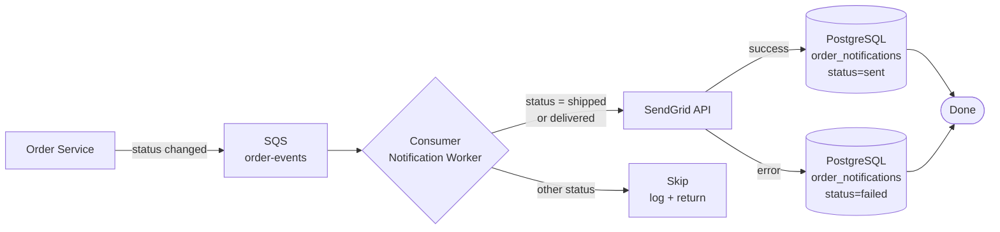

# Example Spec: Order Status Notifications

> This is a complete example of a spec produced by spec.create.
> **Diagram type showcased:** `flowchart LR` — use this pattern when the behavior involves
> asynchronous processing, message queues, or event-driven steps that don't fit a linear
> request/response model.

---

## 1. Overview

- **Title**: Notificações de Status de Pedido por Email
- **Status**: Review
- **Author**: platform-team
- **Created**: 2026-04-01
- **Version**: 1.0.0

## 2. Problem Statement

Clientes não recebem comunicação automática quando o status de seus pedidos muda. Isso gera volume desnecessário de contatos ao suporte e reduz a experiência pós-compra. Atualmente toda consulta de status é iniciada pelo cliente — o sistema não notifica proativamente.

## 3. Goals & Non-Goals

**Goals:**
- Enviar email automático ao cliente quando o pedido muda para `shipped` ou `delivered`
- Garantir que o envio não bloqueie nem atrase a operação de mudança de status
- Registrar cada notificação enviada para fins de auditoria e LGPD

**Non-Goals:**
- Notificações por SMS ou push mobile
- Painel de configuração de preferências para o cliente (deferred)
- Retry automático de emails com falha de entrega no provider
- Internacionalização dos templates de email

## 4. Proposed Solution

Ao mudar o status de um pedido, o serviço de pedidos publica um evento em uma fila SQS. Um consumer dedicado lê esses eventos, filtra os status relevantes, e dispara o envio via SendGrid Dynamic Templates. O histórico de envios é persistido na tabela `order_notifications` no PostgreSQL existente.

## 5. Technology Decisions

| Concern | Decision | Alternatives Considered | Rationale |
|---------|----------|------------------------|-----------|
| Email provider | SendGrid (existente) | SES, Mailgun | Já contratado e com templates configurados |
| Entrega do disparo | Assíncrono via SQS | Síncrono na request, SNS | Desacopla mudança de status do envio; tolerante a falhas do provider |
| Templates | SendGrid Dynamic Templates | Go html/template, hardcoded | Editável sem deploy; suportado pelo contrato SendGrid atual |
| Persistência de histórico | PostgreSQL — tabela `order_notifications` | Sem persistência, tabela separada | DB já em uso; histórico necessário para auditoria LGPD |
| Opt-out (LGPD) | Link de unsubscribe nativo do SendGrid | Configuração no perfil do usuário | Solução mais simples; atende requisito legal sem nova UI |

## 6. Detailed Design

### 6.1 API / Interface

```go
// NotificationService define o contrato do serviço de notificações
type NotificationService interface {
    SendOrderStatusEmail(ctx context.Context, event OrderStatusChangedEvent) error
}

type OrderStatusChangedEvent struct {
    OrderID    string    `json:"order_id"`
    CustomerID string    `json:"customer_id"`
    NewStatus  string    `json:"new_status"`
    OccurredAt time.Time `json:"occurred_at"`
}
```

### 6.2 Data Model

Nova tabela `order_notifications`:

```go
type OrderNotification struct {
    ID         string    `db:"id"`
    OrderID    string    `db:"order_id"`
    CustomerID string    `db:"customer_id"`
    Status     string    `db:"status"`      // "sent" | "skipped" | "failed"
    Channel    string    `db:"channel"`     // "email"
    SentAt     time.Time `db:"sent_at"`
    CreatedAt  time.Time `db:"created_at"`
}
```

### 6.3 Behavior & Logic



**Passos do consumer:**
1. Recebe mensagem SQS com `OrderStatusChangedEvent`
2. Verifica se `new_status` é `shipped` ou `delivered` — se não, faz skip (registra `skipped`) e confirma mensagem
3. Busca email e nome do cliente pelo `customer_id` no serviço de usuários
4. Seleciona o Dynamic Template ID correspondente ao status
5. Dispara envio via SendGrid com os dados do pedido
6. Persiste resultado em `order_notifications` (sent/failed)
7. Confirma (`ack`) a mensagem SQS independente do resultado — falhas de envio não reprocessam

## 7. Acceptance Criteria

- [ ] Ao mudar status de um pedido para `shipped`, o cliente recebe email em até 30s
- [ ] Ao mudar status para `delivered`, o cliente recebe email em até 30s
- [ ] Mudanças para `pending` ou `cancelled` não disparam email (registradas como `skipped`)
- [ ] Email contém link de opt-out funcional via unsubscribe do SendGrid
- [ ] Após opt-out, nenhum email adicional é enviado para aquele endereço
- [ ] Cada tentativa de envio é registrada em `order_notifications` com status e timestamp
- [ ] Falha no SendGrid não causa reprocessamento da mensagem SQS (mensagem é confirmada mesmo com erro)

## 8. Technical Considerations

- **Idempotência:** se a mesma mensagem SQS for entregue mais de uma vez (at-least-once), pode haver emails duplicados. Mitigação: verificar `order_id + status` em `order_notifications` antes de enviar.
- **LGPD:** o histórico em `order_notifications` deve respeitar a política de retenção de dados do cliente. Incluir `customer_id` para facilitar exclusão em caso de solicitação de apagamento.
- **Dependencies:** SendGrid SDK (`github.com/sendgrid/sendgrid-go`), AWS SDK para SQS — ambos já em `go.mod`.
- **Breaking changes:** nenhum — o serviço de pedidos só precisa publicar eventos na fila existente. Nenhum contrato existente é alterado.
- **Observabilidade:** logar `order_id`, `customer_id` e `status` em cada tentativa de envio para rastreabilidade.

## 9. Open Questions

- [ ] [TODO: decide — qual o comportamento em caso de erro ao buscar o email do cliente? Opções: skip (registra failed), retry com backoff, dead-letter queue]
- [ ] [TODO: decide — quais outros status além de `shipped` e `delivered` devem disparar email em versões futuras?]
