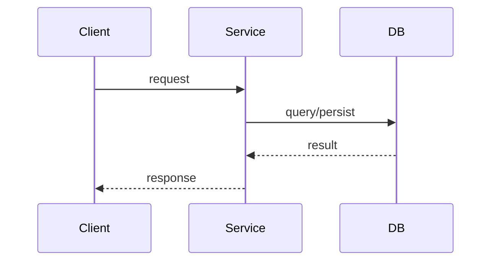

# Spec Template

Use this template when creating a new spec document. Fill all sections with concrete content; use `[TODO: describe ...]` only when information requires a human decision.

---

## 1. Overview

- **Title**: Clear, concise feature title
- **Status**: Draft | Review | Approved
- **Author**: (infer from git config or leave blank)
- **Created**: (today's date)
- **Version**: 1.0.0

## 2. Problem Statement

Describe the problem this feature/story solves. Be clear and objective.

## 3. Goals & Non-Goals

**Goals:**
- List what this spec intends to achieve

**Non-Goals:**
- List what is explicitly out of scope

## 4. Proposed Solution

High-level description of the proposed approach.

## 5. Technology Decisions

Explicit record of technology choices made for this feature. Every row must have a clear **Decision** — no implicit choices.

| Concern | Decision | Alternatives Considered | Rationale |
|---------|----------|------------------------|-----------|
| Data storage | e.g. PostgreSQL (existing users DB) | DynamoDB, Redis | Already in use; relational model fits |
| API style | e.g. REST — POST /resource | GraphQL, gRPC | Team convention |
| Auth | e.g. JWT via existing middleware | OAuth, API key | Consistent with rest of API |
| Async processing | e.g. None — synchronous | SQS, background job | Low volume, latency acceptable |
| Infrastructure | e.g. ECS Fargate (existing cluster) | Lambda, EC2 | Follows service deployment standard |

> Use `[TODO: decide — options: A, B, C]` for any row where the decision is not yet made.

## 6. Detailed Design

### 6.1 API / Interface

Define public interfaces, function signatures, or API contracts.

```go
// Interface definitions go here
type ServiceName interface {
    MethodName(ctx context.Context, input InputType) (OutputType, error)
}
```

### 6.2 Data Model

Describe any new or modified data structures, schemas, or types.

```go
// Type definitions go here
type EntityName struct {
    ID        string    `json:"id"`
    CreatedAt time.Time `json:"created_at"`
}
```

### 6.3 Behavior & Logic

Step-by-step description of how the solution works.

> Add a Mermaid diagram here when behavior involves a multi-step flow (3+ steps, 2+ components),
> state transitions, or async processing. Use `sequenceDiagram` for request/response,
> `stateDiagram-v2` for state machines, or `flowchart LR` for async/event flows.
> Omit if the prose is already unambiguous without a diagram.



## 7. Acceptance Criteria

Define clear, testable acceptance criteria:

- [ ] Criterion 1
- [ ] Criterion 2
- [ ] Criterion 3

## 8. Technical Considerations

- Performance implications
- Security considerations
- Dependencies and integrations
- Breaking changes (if any)

## 9. Open Questions

List unresolved questions that require decisions before or during implementation.
